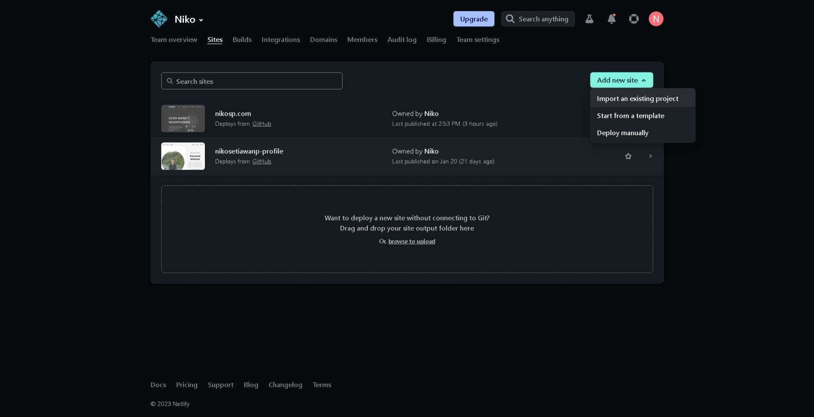

# My Website

> Assignment Example for My Portfolio

This is a simple website of **AUDIOPHILE** made using HTML and CSS.

## Links/URLs

- <https://nikosp.com>
- <https://github.com/revou-fsse-1/w4-my-portfolio-nikosetiawanp>
- <https://nikosp.netlify.app>

## Netlify Registration Process

- First, create account on Netlify. If you have google account, you don't need to create a new account, just sign in with your google account.
  

## Github Auto Deployment

- To auto deploy your project to netlify, you need to import your github project into netlify.
- To do this, click <b> SITES-ADD NEW SITE-IMPORT EXISTING PROJECT </b>
  

- Next, connect your GitHub account and follow through the proccess
  
  -Then, choose the repository you want to auto deploy.
  
  -Finally, click <b> Deploy Site</b>. Your site should now deployed with random domain from netlify.
  

  ## Adding Custom Domain

- To add custom domain to your website, first you need to buy the domain. In this case I'm using google domain.
  

- In netlify, go to <b>SITE SETTINGS-DOMAIN MANAGEMENT-DOMAINS </b>, and edit domain. Then, enter your domain name.
  

- Then, on the right side of your new custom domain, click <b> OPTIONS-GO TO DNS PANEL</b>
  

- Next, copy the 4 name servers that netlify provided, and paste it to
  

- On google domain, go to your domain, and click on <b>DNS-CUSTOM NAME SERVERS-MANAGE NAME SERVERS</b>, and input 4 name servers that you copied from netlify.

  

  - Wait until propagation process is done, and your site is ready to go public

  
